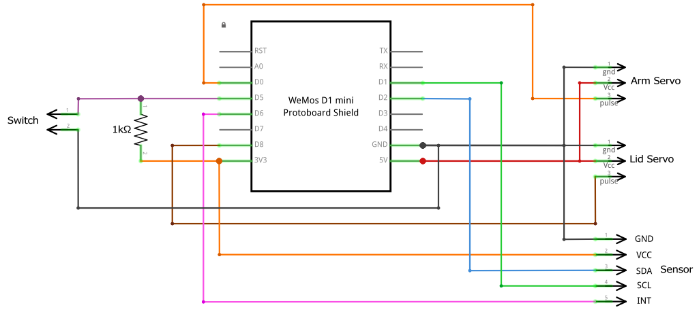
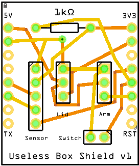

# Useless Box with ESP8266

A useless box made smarter with an ESP8266 microcontroller and an APDS-9660 proximity sensor to give more funny responses.

## Hardware

## Wiring

The wiring is designed to create a custom shield for the Wemos D1 Mini ESP8266 microcontroller-based board, instead of soldering the cables directly to the board. In this way you can easily assemble the parts or even reuse them in the future.

### Schematics

### PCB

The PCB was designed with [Fritzing](https://fritzing.org), and you can [download the source file](./wiring/Useless Box Shield v1.fzz) to further customize it to your needs.

You can also [download the Gerber files](./wiring/Useless Box Shield v1 PCB Gerber.zip) which you can use to order the PCB from your preferred PCB manufacturer. (Note: I've created my prototype manually then documented it in Fritzing, so I have not tested this PCB yet.)

## The Box

I designed a custom box for this project which can be 3D printed or even further customized. You can download the model from ...

## About the author

This project is maintained by [György Balássy](https://linkedin.com/in/balassy).
