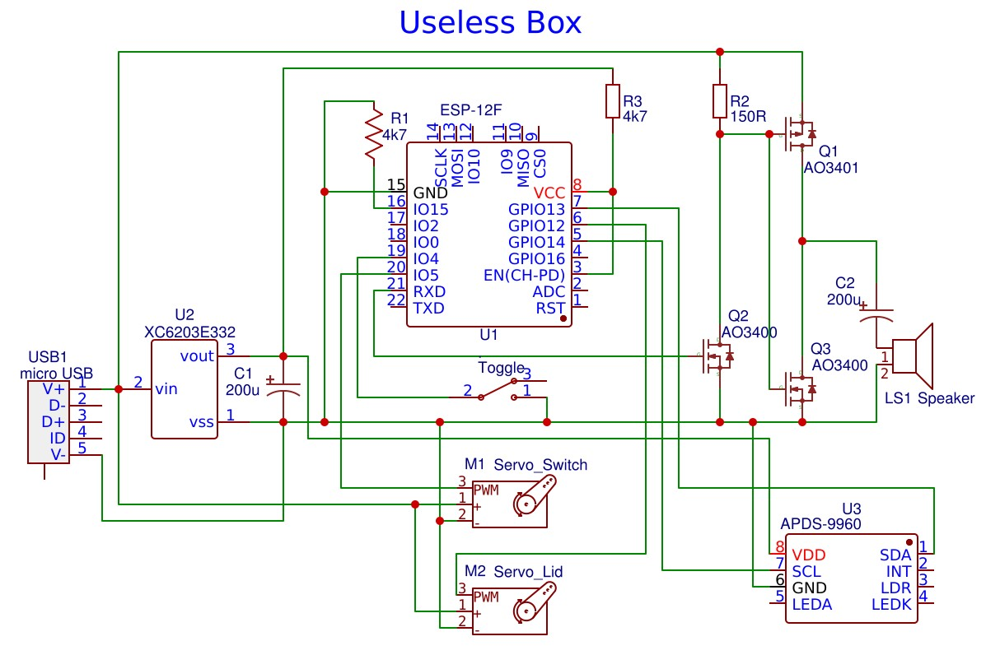

# Smart Useless Box with ESP8266 and Gesture Sensor modified

This is a modification of the excellent Useless Box from balassy.

The enclosure is the same but the software now has following additions.

- Wifi support via WifiManager
- SPIFFS support with filsing and uploads
- Configuration via a file in SPIFFS
- Software update via OTA web browser
- Modfied schematic with an amplifier and loudspeaker to give speech responses
- Audio output via a software DAC using ESP8266Audio library

The SPIFFS config file controls
- servo positions and speeds 
- Actions are defined in the config file as sequences of base commands which control servo movements, delays, audio responses and sensor control
- Sensor audio responses may be varied
- Comments in the example config file list possible commands to be used in the sequences.
- Sequences can either run one after another or can be selected at random.

For my hardware I used an ESP-12F rather than the Wemos but that is a personal preference. The speaker in my case was a 21mm diameter but larger ones can be used.

##Set up Notes

- Modify passwords for Wifimanager and firmware updates in uselessBox.ino
- Compile and serial upload using Arduino ESP8266 IDE. Code / SPIFFS split needs to be 2MB/2MB to allow for OTA to work.
- WifiManager will start an AP portal when first used to set local wifi parameters. After that it will hook into local network.
- Browse to the device using its IPaddress/upload and upload from data director (edit.htm.gz, favicon.ico, graphs.js.gz). From then on IPaddress/edit may be used to manage SPIFFs content
- Upload uselessConfig.txt, index.html, and .mp3 audio files to SPIFFs 
- You can customise these as required. Audio files can be created using an online text to audio service like Notevibes.
- Simple test of servos and audio may be done from base index page at IPaddress/edit
- OTA updates may be done by exporting a compiled binary in Arduino IDE and then browsing to IPAddress/firmware

The following is directly from balassy README

## Smart Useless Box with ESP8266 and Gesture Sensor modified

A useless box made smarter with an ESP8266 microcontroller on a Wemos D1 Mini board and an APDS-9960 proximity sensor to give more funny responses.

## YAUB (Yet Another Useless Box)?

Useless machines are not new, there are many versions available. You can create a simple one using a lever switch, however that will react always the same way. Using a programmable microcontroller you can create **funny, unexpected responses**, and by adding a proximity sensor you can surprise the user with **actions before she would even turn on the switch**!

This is a programmable useless box, so you have the option to implement **additional reactions** when you want to to further improve this funny little toy. What's more the used controller board has WiFi connectivity, so you can **connect it to other online services** (e.g. IFTTT) or **smart assistants** (Alexa, Cortana etc.).

## Smart Useless Box in Action

Click the image below to see this box in action:

## Hardware

The following hardware components are required to build this project:

- 1 × [Wemos D1 Mini board](https://wiki.wemos.cc/products:d1:d1_mini)
- 1 × [APDS-9960 RGB, gesture and proximity sensor](https://www.sparkfun.com/products/12787) - there are multiple versions of this board, use one that follows the pinout of the SparkFun module to simplify wiring. I used [this](https://www.aliexpress.com/item/32768898229.html) cheap one from AliExpress.
- 2 × [SG90 servo motors](https://components101.com/servo-motor-basics-pinout-datasheet)
- 1 × Switch - you have to test this to ensure it flips easily and the servo is strong enough to flip it, so I bought mine in the nearest electronics hardware store.
- 1 × 1kΩ resistance
- Male pin headers:
  - 1 × 1x2 for the switch
  - 2 × 1x3 for the servo motors
  - 1 × 1x5 for the sensor
- Prototype board or PCB - to create a shield for the Wemos D1 Mini.
- Pin headers - to connect the shield to the Wemos D1 Mini.
- Dupont cables or wires with connectors.
- BluTack - to mount the wires and the controller board.
- M3 screws - to mount the lids.

## Wiring

The wiring is designed to create a custom shield for the Wemos D1 Mini ESP8266 microcontroller-based board, instead of soldering the cables directly to the board. In this way you can easily assemble the parts or even reuse them in the future.

### Schematics

### PCB

The PCB was designed with [Fritzing](https://fritzing.org), and you can [download the source file](./wiring/Useless-Box-Shield-v1.fzz) to further customize it to your needs.

You can also [download the Gerber files](./wiring/Useless-Box-Shield-v1-PCB-Gerber.zip) which you can use to order the PCB from your preferred PCB manufacturer. (Note: I've created my prototype manually then documented it in Fritzing, so I have not tested this PCB yet.)

## Software

The source code in this repo is created with [Visual Studio Code](https://code.visualstudio.com) using the [Arduino plugin from Microsoft](https://marketplace.visualstudio.com/items?itemName=vsciot-vscode.vscode-arduino), but it should work with the [Arduino IDE](https://www.arduino.cc/en/main/software) as well.

The code in this repository is preconfigured with the pin layout shown in the wiring diagram above, but if you decide to connect the parts to different pins, you have to update the values in the `config.h` file.

After finalizing the pin configuration (or using the default one) just upload the code to the Wemos D1 Mini board.

The responses of the box are implemented in the `useless-box.ino` file, and the `run()` function is responsible for selecting and executing the reaction to a flip of the switch or to a signal from the sensor. Feel free to add new logic or remove any existing reaction you don't like in this function.

## The Box

I designed a custom box for this project which can be 3D printed or even further customized. You can download the model from [Thingiverse](https://www.thingiverse.com/thing:3856965) or [MyMiniFactory](https://www.myminifactory.com/object/3d-print-100944).

Happy Printing! :)

## About the author

This project is maintained by [György Balássy](https://linkedin.com/in/balassy).
